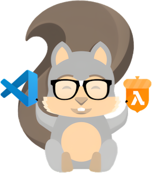

# aws-sam-vscode



The aws-sam-vscode is a set of BASH scripts and configurations that easily, securely, and very functionally integrates the Visual Studio Code (VSCode) debugger with the AWS Serverless Application Model (SAM).

The serverless applications (lambdas) execution will be done through an application server, that is, in the same way as it will occur in AWS. Execution as stript? Never again! Debug AWS serverless applications (lambdas) in much the same way as non-serverless applications.

This is a free, open source, game-changing debugging tool. Enjoy! 😎

**FURTHER:** This project was conceived and tested under Linux 🐧❤️ , but can be adapted for use with M$ Windows 💸 as long as BASH is supported. Currently this project only supports projects in Python, but support for other languages can also be added without major problems.

**IMPORTANT:** My life, my work and my passion is free software. Corrections, tweaks and improvements are very welcome (**pull requests** 😉)! Please consider giving us a ⭐, fork, support this project or even visit our professional profile (see [About](#about)). **Thanks!** 🤗

# Donations

I'm just a regular everyday normal guy with bills and family.  
This is an open-source project and will continue to be so forever.  
Please consider to deposit a donation through PayPal...

[](https://www.paypal.com/donate/?hosted_button_id=TANFQFHXMZDZE)

**Support free software and my work!** ❤️👨‍👩‍👧🐧

# Table of Contents

  * [How to use aws-sam-vscode](#how-to-use-aws-sam-vscode)
  * [Install Docker and VSCode](#install-docker-and-vscode)
  * [Install Pyenv and create a Python virtual environment](#install-pyenv-and-create-a-python-virtual-environment)
  * [Install AWS CLI and AWS SAM](#install-aws-cli-and-aws-sam)
    + [If Ubuntu](#if-ubuntu)
    + [If Manjaro](#if-manjaro)
    + [Check AWS CLI and AWS SAM installation](#check-aws-cli-and-aws-sam-installation)
  * [Create an AWS SAM application (basic example)](#create-an-aws-sam-application-basic-example)
    + [Create application](#create-application)
  * [Add the aws-sam-vscode project components to your project](#add-the-aws-sam-vscode-project-components-to-your-project)
  * [Create a Python virtual environment](#create-a-python-virtual-environment)
  * [Install VSCode extensions](#install-vscode-extensions)
  * [Configure aws-sam-vscode on your project](#configure-aws-sam-vscode-on-your-project)
    + [config.bash](#configbash)
    + [venv.bash](#venvbash)
    + [call.bash](#callbash)
  * [Start the debugger](#start-the-debugger)
  * [Install Python packages in your project virtual environment.](#install-python-packages-in-your-project-virtual-environment)
- [Extra](#extra)
  * [Install Docker Community Edition (CE)](#install-docker-community-edition-ce)
    + [If Ubuntu](#if-ubuntu-1)
    + [If Manjaro](#if-manjaro-1)
      - [Manage Docker as a non-root user](#manage-docker-as-a-non-root-user)
  * [Install Visual Studio Code (VSCode)](#install-visual-studio-code-vscode)
    + [If Ubuntu](#if-ubuntu-2)
    + [If Manjaro](#if-manjaro-2)
  * [Install Pyenv](#install-pyenv)
    + [Install needed packages](#install-needed-packages)
      - [If Ubuntu](#if-ubuntu-3)
      - [If Manjaro](#if-manjaro-3)
    + [Install Pyenv](#install-pyenv-1)
  * [Increase the inotify limits](#increase-the-inotify-limits)
    + [If Ubuntu](#if-ubuntu-4)
    + [If Manjaro](#if-manjaro-4)
  * [References](#references)
- [About](#about)

## How to use aws-sam-vscode

There are dozens of ways to install the necessary components to use aws-sam-vscode, however we provide a complete roadmap where we present how to install these components in the way we deem best and easiest for Ubuntu (Debian based) and Manjaro (Arch based).

## Install Docker and VSCode

The installation of Docker and VSCode is not the focus of this roadmap, however we provide in the sections [Install Docker Community Edition (CE)](#install-docker-community-edition-ce) and [Install Visual Studio Code (VSCode)](#install-visual-studio-code-vscode) how to do it.

## Install Pyenv and create a Python virtual environment

The installation of Pyenv and creation of a Python virtual environment is not the focus of this guide, however we provide in the sections [Install Pyenv](#install-pyenv) and [Create a Python virtual environment](#create-a-python-virtual-environment) how to do it.

**NOTE:** In this roadmap we chose to use Pyenv because we believe it is the best option for Python version management, however any other could be used by simply configuring the ".debug/venv.bash" file. This file will be available in the project after installation and contains commands for activating the virtual environment.

## Install AWS CLI and AWS SAM

Install AWS Command Line Interface (AWS CLI) and AWS Serverless Application Model (AWS SAM).

### If Ubuntu

```
apt-get -y install awscli
wget https://github.com/aws/aws-sam-cli/releases/latest/download/aws-sam-cli-linux-x86_64.zip
unzip aws-sam-cli-linux-x86_64.zip -d sam-installation
```

### If Manjaro

```
yay -S --noconfirm aws-cli-v2
yay -S --noconfirm aws-sam-cli-bin
```

### Check AWS CLI and AWS SAM installation

```
aws --version
sam --version
```

**TIP:** A recurring problem with using the AWS SAM with VSCode in a development environment is reaching the limits of inotify. In order to avoid these problems we need to increase these limits. We provide in the section [Increase the inotify limits](#increase-the-inotify-limits) how to do it.

## Create an AWS SAM application (basic example)

### Create application

Navigate to the directory in which you want to create your AWS SAM application and run the command...

**MODEL**

```
sam init --runtime <PYTHON_VERSION> --name <APP_NAME>
```

**EXAMPLE**

```
sam init --runtime python3.8 --name aws-sam-app
```

... and choose "AWS Quick Start Templates" (1), "Hello World Example" (1), "no" (n) and "no" (n).

## Add the aws-sam-vscode project components to your project

Being in the same directory in which you created your AWS SAM application (and its folder), clone the aws-sam-vscode project...

```
git clone https://github.com/eduardolucioac/aws-sam-vscode.git
```

... and copy from it the required components into your project...

**MODEL**

```
cp -vr ./aws-sam-vscode/resources/. ./<APP_NAME>
```

**EXAMPLE**

```
cp -vr ./aws-sam-vscode/resources/. ./aws-sam-app
```

Being in the same directory in which you created your AWS SAM application (and its folder), configure some needed resources...

**MODEL**

```
rm -f ./<APP_NAME>/hello_world/requirements.txt

sed -i 's/import json/# NOTE: This MUST BE THE VERY FIRST CODE EXECUTED, since it is what allows the debugger\n# use\.\nimport os\nif "on" == os\.getenv("DEBUG", default="off"):\n    import ptvsd\n    ptvsd\.enable_attach(address=("0\.0\.0\.0", 5890), redirect_output=True)\n    ptvsd\.wait_for_attach()\n\nimport json/g' ./<APP_NAME>/hello_world/app.py

sed -i 's/  Sample SAM Template for aws-sam-app/  Sample SAM Template for aws-sam-app\n\nParameters:\n  Debug:\n    Type: String\n    Default: "off"/g' ./<APP_NAME>/template.yaml

sed -i 's/    MemorySize: 128/    MemorySize: 128\n    Environment:\n      Variables:\n        DEBUG: !Ref Debug/g' ./<APP_NAME>/template.yaml

sed -i 's/CodeUri: hello_world\//CodeUri: \.\//g' ./<APP_NAME>/template.yaml

sed -i 's/Handler: app\.lambda_handler/Handler: hello_world\/app\.lambda_handler/g' ./<APP_NAME>/template.yaml
```

**EXAMPLE**

```
rm -f ./aws-sam-app/hello_world/requirements.txt

sed -i 's/import json/# NOTE: This MUST BE THE VERY FIRST CODE EXECUTED, since it is what allows the debugger\n# use\.\nimport os\nif "on" == os\.getenv("DEBUG", default="off"):\n    import ptvsd\n    ptvsd\.enable_attach(address=("0\.0\.0\.0", 5890), redirect_output=True)\n    ptvsd\.wait_for_attach()\n\nimport json/g' ./aws-sam-app/hello_world/app.py

sed -i 's/  Sample SAM Template for aws-sam-app/  Sample SAM Template for aws-sam-app\n\nParameters:\n  Debug:\n    Type: String\n    Default: "off"/g' ./aws-sam-app/template.yaml

sed -i 's/    MemorySize: 128/    MemorySize: 128\n    Environment:\n      Variables:\n        DEBUG: !Ref Debug/g' ./aws-sam-app/template.yaml

sed -i 's/CodeUri: hello_world\//CodeUri: \.\//g' ./aws-sam-app/template.yaml

sed -i 's/Handler: app\.lambda_handler/Handler: hello_world\/app\.lambda_handler/g' ./aws-sam-app/template.yaml
```

**IMPORTANT:** Some of the commands just above modify certain aspects referring to the organization of the project in the "template.yaml" file. These actions are intended to facilitate the use and organization of the project, but can be easily reversed if you prefer the default organization.

**NOTES:**  
 I - The configuration commands above will add support for Python Visual Studio and Visual Studio Code Debugger (ptvsd).  
 II - This debug scheme will be activated through the use of the "DEBUG" environment variable, which is set by command line during the debugger initialization by the aws-sam-vscode project. This scheme will have no impact on your production environment.  
 III - Although the ptvsd package added to "requirements.txt" does not impact production environment, it will not be needed in this environment.

## Create a Python virtual environment

Install a Python interpreter with Pyenv running the command...

**MODEL**

```
cd ./<APP_NAME>
pyenv install <PYTHON_VERSION>
```

**EXAMPLE**

```
cd ./aws-sam-app
pyenv install 3.8.12
```

**TIP:** To get a list of available Python versions run the commands `pyenv install -l`.

Go to your AWS SAM application directory create and activate a Python virtual environment running the commands...

**MODEL**

```
cd ./<APP_NAME>
pyenv virtualenv 3.8.12 <APP_NAME>
pyenv local <APP_NAME>
```

**EXAMPLE**

```
cd ./aws-sam-app
pyenv virtualenv 3.8.12 aws-sam-app
pyenv local aws-sam-app
```

**NOTE:** Note that after executing the last command above the directory will be activated for the virtual environment created. This will be denoted by the presence of the text "(aws-sam-app)"/"(<APP_NAME>)" in the terminal. Note that if the Pyenv setup is correct, the directory will be activated automatically whenever we access it.

## Install VSCode extensions

Launch "VSCode Quick Open" (Ctrl+p), paste each one from commands below and press Enter...

```
ext install AmazonWebServices.aws-toolkit-vscode
ext install formulahendry.code-runner
ext install ms-python.python
```

**NOTES:**  
 I - These are the minimum VSCode extensions needed for the schema to work properly.  
 II - The VSCode itself will try to install them due to the settings in the "./<APP_NAME>/.vscode/extensions.json" file.  

## Configure aws-sam-vscode on your project

### config.bash

The `./<APP_NAME>/.debug/config.bash` file contains parameters and instructions how to use them to configure the project.

### venv.bash

The `./<APP_NAME>/.debug/venv.bash` file contains commands for activating the Python virtual environment. You can configure it according to your needs.

### call.bash

The `./<APP_NAME>/.debug/call.bash` file contains an HTTP call (`curl http://127.0.0.1:3000/hello`) to automate the debug process. You can configure it according to your needs.

**NOTE:** The debug process does not start until an valid HTTP call is made to the project.

## Start the debugger

Launch VSCode "Quick Open" (Ctrl+Shift+p), paste the command...

"""
Python: Select Interpreter
"""

... in the text box, press "Enter" and select the...

**EXAMPLE**

"""
Python 3.8.12 64-bit ('aws-sam-app')
"""

... virtual environment you created from the list.

Add a breakpoint to the "lambda_handler" function in the `./<APP_NAME>/hello_world/app.py` file, start the VSCode debugger with the "F5" key and if everything is correct the execution will stop at the breakpoint.

Done! Now we can use the VSCode debugger with an AWS Command Line Interface (AWS CLI) project! Groovy! 😎

**TIP:** Use Ctrl+c or Ctrl+d or click on the trash can symbol next to the task name (appears when the mouse pointer is over) to release held terminals if this happens.

## Install Python packages in your project virtual environment.

As the AWS serverless application runs inside a container, installing your project's Python packages in the virtual environment is not mandatory, but VSCode will only work fully if you do.

Install Python packages in your project virtual environment...

**MODEL**

```
cd ./<APP_NAME>
pip install -r ./requirements-dev.txt
```

**EXAMPLE**

```
cd ./aws-sam-app
pip install -r ./requirements-dev.txt
```

# Extra

## Install Docker Community Edition (CE)

### If Ubuntu

Install needed packages...

```
apt-get -y update
apt-get -y upgrade # Updating the OS is a good practice. =D
apt-get -y install apt-transport-https
apt-get -y install ca-certificates
apt-get -y install software-properties-common
```

Add the Docker repository GPG key...

```
wget -q -O - https://download.docker.com/linux/ubuntu/gpg | apt-key add -
```

Add the Docker repository...

```
add-apt-repository "deb [arch=amd64] https://download.docker.com/linux/ubuntu focal stable"
```

Configure to install from the Docker repository...

```
apt-cache policy docker-ce
```

Install Docker...

```
apt-get -y install docker-ce
```

Check if Docker daemon is running...

```
docker --version
```

... and check Docker version...

```
systemctl status docker.service
```

### If Manjaro

Install needed packages and Docker...

```
pamac install --no-confirm yay
yay -Syyuu --noconfirm # Updating the OS is a good practice. =D
yay -S --noconfirm docker
```

Enable and start Docker services...

```
systemctl enable docker.service
systemctl start docker.service
```

Check if Docker daemon is running...

```
docker --version
```

... and check Docker version...

```
systemctl status docker.service
```

#### Manage Docker as a non-root user

Create the "docker" group...

```
groupadd docker
```

Add your user to the docker group (as your user)...

```
sudo usermod -aG docker $USER
```

**IMPORTANT:** Use `sudo` (your user), not `sudo su` (root)!

Run the following command to activate the changes to groups (as your user) ...

```
newgrp docker
```

Verify that you can run docker commands without sudo...

```
docker run hello-world
```

**IMPORTANT:** In order for these changes effectively take effect, the OS must be restarted.

## Install Visual Studio Code (VSCode)

### If Ubuntu

Install needed packages...

```
apt-get -y install software-properties-common
apt-get -y install apt-transport-https
```

Import the M$ 💸 GPG key...

```
wget -q -O - https://packages.microsoft.com/keys/microsoft.asc | apt-key add -
```

Enable VSCode repository...

```
add-apt-repository "deb [arch=amd64] https://packages.microsoft.com/repos/aws-sam-app stable main"
```

Install VSCode...

```
apt-get -y install code
```

### If Manjaro

Install VSCode...

```
yay -S --noconfirm visual-studio-code-bin
```

## Install Pyenv

### Install needed packages

#### If Ubuntu

```
apt-get -y install make
apt-get -y install build-essential
apt-get -y install libssl-dev
wget http://nz2.archive.ubuntu.com/ubuntu/pool/main/o/openssl/libssl1.1_1.1.1f-1ubuntu2.16_amd64.deb
dpkg -i libssl1.1_1.1.1f-1ubuntu2.16_amd64.deb
rm -f libssl1.1_1.1.1f-1ubuntu2.16_amd64.deb
apt-get -y install zlib1g-dev
apt-get -y install libbz2-dev
apt-get -y install libreadline-dev
apt-get -y install libsqlite3-dev
apt-get -y install llvm
apt-get -y install libncursesw5-dev
apt-get -y install xz-utils
apt-get -y install tk-dev
apt-get -y install libxml2-dev
apt-get -y install libxmlsec1-dev
apt-get -y install libffi-dev
apt-get -y install liblzma-dev
apt-get -y install git
```
#### If Manjaro

```
yay -S --noconfirm base-devel
yay -S --noconfirm openssl
yay -S --noconfirm openssl-1.1
yay -S --noconfirm zlib
yay -S --noconfirm xz
yay -S --noconfirm git
```

### Install Pyenv

Install Pyenv...

```
wget -q -O - https://pyenv.run | bash
```

Adjust the command interpreter (BASH) configuration file (~/.bashrc)...

```
read -r -d '' FILE_CONTENT << 'HEREDOC'
BEGIN

# >>>>>>
# Pyenv configurations.

export PYENV_ROOT="$HOME/.pyenv"
export PATH="$PYENV_ROOT/bin:$PATH"
eval "$(pyenv init --path)" # This only sets up the path stuff.
eval "$(pyenv init -)" # This makes pyenv work in the shell.
eval "$(pyenv virtualenv-init -)" # Enabling virtualenv so it works natively.
# <<<<<<

END
HEREDOC
echo -n "${FILE_CONTENT:6:-3}" | tee -a ~/.bashrc
```

Reload ".bashrc"...

```
source ~/.bashrc
```

## Increase the inotify limits

To increase the inotify limits permanently (across reboots), adding the following lines to set the maximum number of watches to 524288 and the maximum number of instances to 1024...

**NOTE:** We had no problems with the configurations suggested above, but if you deem it necessary, you can configure it according to your needs.

### If Ubuntu

```
echo "fs.inotify.max_user_watches=524288
fs.inotify.max_user_instances=1024
" | tee -a /etc/sysctl.conf
sysctl -p # To reload the configuration.
```

### If Manjaro

```
echo "fs.inotify.max_user_watches=524288
fs.inotify.max_user_instances=1024
" | tee -a /etc/sysctl.d/99-sysctl.conf
sysctl --system # To reload the configuration.
```

You can also set the limits temporarily, until the next reboot, with sysctl...

```
sysctl fs.inotify.max_user_watches=524288
sysctl fs.inotify.max_user_instances=1024
```

**NOTE:** Be sure to choose limits that are higher than the total number watches created by all processes.

## References

https://amaral.northwestern.edu/resources/guides/pyenv-tutorial  
https://archlinux.org/news/deprecation-of-etcsysctlconf/  
https://bigfatsoftwareinc.wordpress.com/2020/11/03/got-system-limit-for-number-of-file-watchers-reached-error/  
https://github.com/pyenv/pyenv/wiki#suggested-build-environment  
https://github.com/pyenv/pyenv/wiki/Common-build-problems  
https://linuxize.com/post/how-to-install-visual-studio-code-on-ubuntu-20-04/  
https://softwareengineering.stackexchange.com/a/25015/409259  
https://stackoverflow.com/a/27978545/3223785  
https://superuser.com/a/743258/195840  
https://thechief.io/c/raeymaeckers/develop-aws-lambda-functions-locally-and-use-aws-sam-deploy-them-your-account/  
https://wiki.archlinux.org/title/sysctl  
https://wiki.manjaro.org/index.php?title=Arch_User_Repository  
https://www.digitalocean.com/community/tutorials/how-to-install-an-erpnext-stack-on-ubuntu-18-04  

# About

**aws-sam-vscode 🄯 BSD-3-Clause**  
Eduardo Lúcio Amorim Costa  
Brazil-DF 🇧🇷  
https://www.linkedin.com/in/eduardo-software-livre/  

**Have fun!** 🐧
